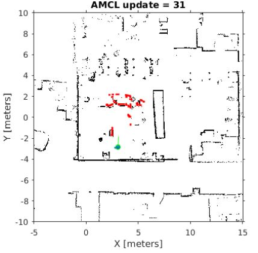

In this Section, we initially discuss controlling the robot velocity and path simply through the velocity
command. Then the robot is subjected to the constraint o  
<h3>Robot Localization</h3>
Localization is concerned with estimating the robots pose w.r.t. a map of the environment. Dead 
reckoning relies on odometry information to determine the relative motion of the robot. The new pose
is calculated from the robot kinematics and the incremental motion of wheels recorded by encoders. 
Dead reckoning requires knowledge of the robot’s initial pose. Its accuracy decreases over time as 
every measurement is subject to noise and errors accumulate due to the integration of incremental 
movements. Nevertheless, dead reckoning is a fundamental component of general localization methods 
as it provides accurate short term information. The presence of uncertainty in both the robot’s 
odometry and the range sensor complicates the localization task. Both pieces of information are 
integrated by a Bayes filter to estimate the pose  

<h3>Particle Filter</h3>
Monte Carlo Localization (MCL) localizes a robot by maintaining a particle filter. The algorithm 
relies on a map of the environment and estimates the robot pose within the map according to odometry
and range sensor information. The algorithm represents its belief of the robot pose by a probability
density function. The density function is sample based; each particle accounts for a possible 
hypothesis of the robot pose. Each particle contains information about the hypothesized robot pose 
and a weight that captures the probability of that pose. The prediction step updates the particles 
poses according to a robot motion model based on the odometry information obtained from the wheel 
encoders or commanded velocities. New robot poses are sampled from the motion model. The correction 
step updates the particle weight based on new sensor readings. The particle pose is evaluated based on
the likelihood of the sensor readings at the current pose given the map. Particles are resampled 
according to their weights, generating more particles in regions of likely poses and eliminating 
unlikely hypotheses. Upon iterating prediction, correction, and resampling the cloud of particles 
eventually converges to a single cluster at the true pose of the robot.  

Markov localization with particle filters hypothesizes at any iteration a set of possible robot poses.
Each particle refers to a candidate pose as it consists of the hypothesized pose of the robot along 
with an importance weight. This importance weight reflects the likelihood that the position 
hypothesized by the particle is true. The localization algorithm is initialized by populating the 
state space with a set of randomly chosen particles (global localization) or initializing their pose 
at the known robot position (local localization). Initially, all particles possess equal weights.  

The Monte Carlo Localization (MCL) algorithm estimates the robot’s pose given a map of the environment,
range sensor readings, and odometry data. In Matlab’s Robotics System Toolbox, the 
<b>robotics.MonteCarloLocalization</b> object and its methods provide an implementation of MCL.  

The MCL algorithm estimates the robot’s pose with a particle filter. The particles reflect a sample 
based probability density of likely robot poses. Each particle {x, y, θ, w} accounts for a possible 
robot pose [x, y, θ] w.r.t. the map frame and a weight w that reflects the confidence in that pose. The
particle clouds converges to a single cluster as the robot wanders around in the environment and senses
novel regions and objects by its range sensor. Wheel encoders provide odometry information that 
captures the robot’s relative motion. The set of particles is maintained and updated through the 
following process:
<ul>
  <li>Particle poses [x, y, θ] are propagated based on incremental motion provided by odometry and the
   detailed motion model <b>MotionModel</b>b>.</li>
  <li>The particle weights w are assigned based on the likelihood of receiving the range sensor reading
   for each particle. The <b>SensorModel</b> captures the probability of a sensor reading given the 
   location of obstacles according to the particles pose.</li>
  <li> The robot pose is estimated by weighting the pose hypothesis with the particle weights.</li>
  <li>Finally, the particles are resampled at a rate defined by the  <b>ResamplingInterval</b>. The 
  purpose of resampling is to better approximate the underlying probability distribution with a 
  sample set by removing particles of low height and increasing the particle density in regions of
  high probability. Resampling replicates high weighted particles and adjusts the number of 
  particles according to the complexity of the distribution.</li>
</ul>

<h3>Odometry-Based Motion Model</h3>
The odometry based motion model composes the transition from previous pose x*t−1 =
[xt−1  yt−1  θt−1] to the current pose x*t  = 
[xt yt θt] into three elementary motions, a rotation by 
δrot1 to align the initial θt-1 with the heading towards the new pose, a 
translation by δtrans followed by a final rotation δrot2 to achieve the final
orientation θt as shown in the figure below.  

  

Odometry provides the information on the incremental motion between consecutive poses. The 
relationship between consecutive poses and the three elementary motions is given by:  
 
 
  

The motion model samples transitions by considering the hypothesized particle transition as a noisy 
version of the nominal transformation obtained from odometry. For that purpose zero mean Gaussian 
noise is added to [δtrans δrot1 δrot2] which variance is proportional to the magnitude of the motion
itself.   
 
 
  
in which N (µ, σ) denotes a random number sampled from a Gaussian with mean µ and variance σ. The 
parameters αi denote the relative error due to odometry, in particular α1 
denotes the rotational error due to rotational motion, α2 the rotational error due to 
translational motion, α3 the translational error due to translation motion and αrot4
the translational error due to rotational motion.

<h3>Range Finder Sensor Model</h3>
The range finder sensor model considers the causes of range readings:
<ul>
  <li>Expected measurements: These are correct readings caused by obstacles in the environment that
   are part of the map. The reading is subject to additive noise from a Gaussian distribution. The 
   expected reading zexp is obtained from ray tracing along the sensor axis for the first
   intersection -with an obstacle. The Gaussian distribution with mean zexp and variance σ.</li>
  <li>Random measurements: Range sensors occasionally produce inexplicable measurements such as 
   crosstalk in sonar sensors. These phantom readings are modeled by a uniform distribution</li>
  <li> Unknown obstacles: Objects in the environment that are not part of the map might cause short
   range readings w.r.t. to the expected reading according to the map. The probability of short
   unexpected readings is captured by an exponential distribution cut-off at the expected obstacle
   distance zexp. The exponential distribution is characterized by a single parameter λ which denotes
   the mean of the exponential.</li>
  <li>Sensor failures: Obstacles are missed altogether, for example absorbing or opaque surfaces for
   the Kinect infrared sensor. These failures usually generate a maximum range measurement modeled
   by a point mass distribution located at zmax.</li>
</ul>
The mixture distribution reflects the superposition of the four possible causes for a range 
reading z:  
 

The mixture weights αhit, αunexp, αmax, αrnd denote the
relative contribution of the individual causes such that:  
  
The result of the following implementation is shown below:

  

<h3>Maximum Likelihood Estimate of Sensor Model Parameters</h3>
It is difficult to obtain the parameter vector β = [αhit, αunexp, 
αmax, αrnd, σ, λ] of the sensor model from an analysis of the interactions
between sensors and environment. Rather, the optimal parameters are obtained by a maximum likelihood
estimate based on observed range readings of the robot at known poses and thus known zexp.
Assume a set of data of observed readings zi and expected readings zexp,i. 
The optimal parameters of the model are those that best explain the observations, exhibiting the 
highest likelihood of the data. Rather than to maximize the likelihood one maximizes the log 
likelihood under the reasonable assumption of independence of observations.  

A similar maximum likelihood approach is used to determine the optimal parameters of the motion model
α = [α1, 2, α3, α4] from true robot motions and odometry
information.