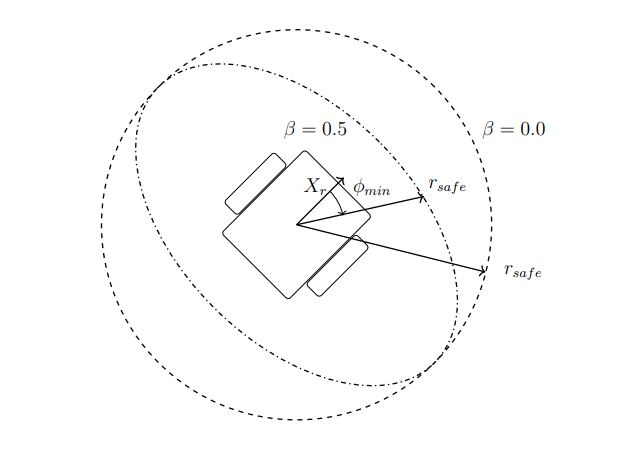
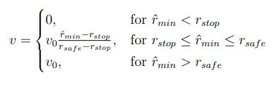
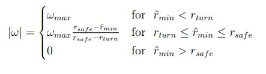
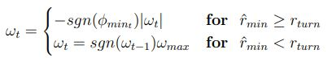

In this Section, initially the publisher-subscriber communication between the ROS and the MATLAB is developed.
The MATLAB publishes the message on the topic '/mobile_base/command_velocity' and a ROS subscriber
receives these motion command messages and moves the simulated robot according to the
commanded velocities.  

<h3>Robot Movement with Publisher</h3>
The Movement of the Robot takes place in the following manner:
- Create a publisher for the '/mobile_base/commands/velocity' topic. Create
an empty message velMsg for that topic. Set the X-component of linear velocity field of the velMsg.Linear.X.
 Publish the message with the command 'send'. The robot should start moving in a straight line. 
 Stop the robot by sending a new message with zero linear velocity.
- Move the robot in a straight line for a specified distance at a specified linear velocity.
The input argument velPub denotes the publisher. The distance traveled by the robot is controlled in an open loop fashion by dead
reckoning as product of commanded velocity and time. The forward motion with
the command velocity executes for a time interval t = d/v seconds. A rate
object with a rate that is inverse proportional to that time interval is utilised.
- The Robot is also rotated on the spot with a particular angular velocity.  

<h3>Callback Subscriber for Laser Scan Messages</h3>
We now focus with subscribing to the '/laserScan' topic and processing
the laser scan message with a Callback function.  The 'sensor_msgs/LaserScan.msg' is
mapped onto a handle object of type ScanHandle which is composed of the properties
ranges and angles. Determine the distance and heading to the most imminent obstacle
with which the robot might collide if it does not alter its direction of motion. This obstacle
representation provides the basis for a reactive obstacle avoidance behavior.
The class ScanHandle has properties of '/laser_scan' topic i.e. Ranges(array of range readings in m) and 
Angles(array of angles in rad). 
A callback function for the '/laser_scan' topic converts the LaserScanMsg into to the ScanHandle object laserScan.  
The function 'nearestObstacle' determines the  distance rmin and heading &phi;min towards the most relevant
obstacle. The relevance of an obstacle depends on its proximity to the robot but
also to the relative heading. Nearby obstacles in longitudinal direction are far
more relevant for obstacle avoidance than remote obstacles or obstacles in lateral
direction.  Thus the scaled obstacle distance is given by 

The robot radius rrobot is subtracted from the range readings ri as those measure the distance to the center of the robot
rather than the distance to the robots perimeter.

<h3>Reactive Obstacle Avoidance</h3>
This is a simple obstacle avoidance behavior which is in terms of a functional mapping between the laser range readings (Subscriber '/laser_scan') and the motor actions (Publisher '/mobile_base/commands/velocity'). Reutilize the handle class, the subscriber Callback and the function nearestObstacle from the previous assignments. The linear velocity v is reduced with decreasing range reading and eventually becomes zero at a stopping distance rstop. The robot is supposed
to stop if the scaled obstacle distance is below the threshold distance i.e. 

The limitations are shown with the intuitive image below:

  

The robot moves at maximum velocity v0 if the obstacle distance exceeds a safe range rsafe. In between rsafe and rstop the robots translational velocity decreases linearly from v = v0 to v = 0.

  

The fundamental relationship between scaled minimum range reading and turn rate &omega; is such that the magnitude of the turn rate increases with decreasing range reading. The robot is supposed to turn at maximum turn rate  &omega; =  &omega;max if the scaled obstacle distance rmin is short of a distance rturn. The robot moves straight &omega; = 0 if the scaled obstacle distance exceeds a safe range rsafe. In between rsafe and rturn the robots turn rate increases linearly from &omega; = 0 to &omega; = &omega;max.

  

The sign of the turn rate depends on the obstacle direction &phi;min under which the nearest obstacle emerges w.r.t. the robocentric frame. The robot is supposed to turn away from the obstacle. Thus the sign of the turn rate &omega; is opposite to the sign of the obstacle direction &phi;min.

These equations establish a purely reactive, memoryless behavior in which controls only depend on the current perception. It leads to robot getting stuck in corners by turning back and forth as&phi;min switches sign for the nearest obstacle to the left and right.  The current turning direction is maintained until the robot clears itself from the obstacle. The control law becomes:

  

