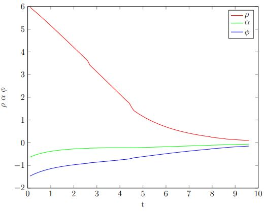

In this Section,   

<h3>Motion Control</h3>
Motion control of a mobile robot is concerned with tracking a feasible reference state
trajectory. The mobile robot regulates its planar pose via the control of its motors in
terms of velocity commands. The approaches rest upon feedback control of the actual
robots pose either w.r.t. a global fixed frame or w.r.t. the reference trajectory. A non-holonomic
robot possesses fewer local degrees of freedom than global degrees of freedom. The prototypical
mobile robot is the unicycle with controls v, ω and global pose xr, yr, θr governed by the 
kinematics:  

A differential drive robot is composed of two independent actuated wheels on a common
axle whose direction is rigidly connected to the robot body. The purpose of the passive orientable
caster wheel is to support the robot, it plays no role in motion control. The kinematic equations 
of the unicycle apply to the Turtlebot differential drive robot as well if one considers the 
robots frame origin to be located on the center of the virtual axle connecting the two driven wheels.
The differential drive robot kinematics are compliant with the unicycle model if left and right wheel
velocities [vl, vr] are mapped onto the vector of linear and angular velocity
[v, ω]. These are shown in the equations below:  

in which b denotes the wheel base of the differential drive robot.

<h3>Feedback Robot Control with Publisher and Subscriber</h3>
The <i>/odom</i> topic provides the robot pose (xr, yr, θr) w.r.t. 
the world frame Xw, Yw . The <i>nav_msgs/Odometry</i> describes the 
orientation of the robot frame in terms of a quaternion q = [&eta; x y z]. As the mobile robot 
resides in a planar world, all rotations of the robot frame are along the z-axis only. The yaw angle 
θr that denotes the rotation between the world x-axis Xw and the robots x-axis
Xr is extracted from the quaternion. The function <b>OdometryMsg2Pose</b> maps the 
message to a pose [x, y, theta].  

The code calculates the general pose error in robo-centric polar coordinates [ρ, α, φ] 
(xr, yr) and goal pose (xg, yg) and maps the error onto 
a motion command v, ω. ρ denotes the Euclidean distance between the current robot position and the 
goal position, α denotes the orientation error between the robot current heading in direction 
Xr and the heading towards the goal pose (xg, yg). The angle φ
denotes the error between current robot heading and the desired orientation at the goal
pose. The angle φ becomes relevant later in the context of homing with goal poses
(xg, yg, θg) rather than merely goal points (xg, yg).

<h3>Homing</h3>
Mobile robot homing is a simpler case of the general task of trajectory tracking as the goal pose is
static. One distinguishes between mere position based homing, in which the robot navigates towards a 
point xg, yg irrespective of the heading at which it approaches the target.
In homing with orientation the robot is expected to approach the target from a particular direction,
for example to enter a docking station for recharging. The robot is expected to acquire pose defined
in terms of xg, yg, θg.  
Homing considers the current position and heading of the robot relative to a desired position and 
calculates a motion command based on their difference. The turn rate ω regulates the heading error
towards the goal point α to zero, the forward velocity is proportional to the Euclidean distance ρ
to the goal. The image below shows the Initial and Goal pose of the mobile robot.

  

We calculates the pose error in polar coordinates ρ, α from the pose messages <i>navGoalMsg</i>. 
Then we determine the goal pose in robo-centric coordinates by transforming the entity <i>navGoalMsg</i>
specified w.r.t. map frame to the ’base_link’ with the function transform. (see lab Robotics System Toolbox III).
Then we obtain the resulting goal pose x(r)g, y(r)g, 
θ(r)g with the function <i>PoseStampedMsg2Pose</i>. The goal position error 
becomes:  

We then implement a simple proportional controller to regulate the heading error α and
the translational error ρ to zero.  

The plot of the evolution of the pose error [ρ, α] over time is shown below.

  

<h3>Trajectory Tracking and Homing with Goal Pose</h3>
Perfect tracking is only achieved if the reference trajectory is feasible for the robot and compliant
with the mobile robot kinematics. The turning radius of a car like robot is bounded from below, which
imposes an upper limit on the reference path curvature. Kinodynamic constraints impose bounds on the 
forward velocity vmaxand turn rate ω ∈ [ωmin, ωmax]. In general case
the robots orientation θ(t) is supposed to follow a reference orientation θg(t) as well. 
For the unicycle robot the reference orientation is tangential to the path in case of a feasible 
reference trajectory. A general reference trajectory (xg(t), yg(t), θg(t)) 
is feasible if it is generated by a reference vehicle with the same kinematics. With the new coordinates e = [ρ, α, φ] the
kinematics are described by:  

The transformation applies for α ∈ I1 = (−π/2, π/2]. In case α ∈ I2 = (−π, −π/2] ∪
(π/2, π] redefining the forward direction of the robot, by setting v = −v, and applying a similar transformation yields:  

with again α(0) ∈ I1. If α ∈ I1, the forward direction of the robot points toward 
the goal, whereas if α ∈ I2, the backward direction of the robot points toward the goal. 
In the first case the robot moves with a positive linear velocity v, whereas in the second case the
translational motion is reversed.  

The linear control law achieves an exponential stabilization of the system at the equilibrium 
(ρ, α, φ) = (0, 0, 0) under the following conditions on the gain:
 0">

 0">
The image of the Global frame, robo-centric frame and goal frame for homing with exponential
stabilization is shown in the figure below.

  

The resulting path generated due to the Goal pose constraint is shown in the figure below.

  

<h3>Pure Pursuit Tracking Algorithm</h3>
The pure pursuit algorithm has the objective to guide a robot along a reference path. Pure pursuit 
is a path tracking scheme that determines the curvature of the robot path that guides the robot from 
its current pose to the goal pose. For that purpose the scheme considers a dynamic goal position on 
the path located some distance ahead of the robots current position. The robot is supposed to chase 
the moving goal point (look ahead point) on the path. This strategy is similar to human drivers that 
steer a vehicle towards a dynamic lookahead point on the road, which distance depends on the vehicle
speed, road curvature and visibility.  
In compliance with ROS transforms the x-axis of coordinate frame coincides with robots current 
heading and the y-axis with the axle connecting the two wheels. The vector (xr − x, yr − y) 
denotes the location of the lookahead (goal) point in the robocentric frame, l denotes the lookahead 
distance. In the following we consider all vectors to be expressed w.r.t. robot base frame. The 
algorithm calculates the radius of the arc that connects the origin of the robocentric frame with 
the goal point. The following relationships hold:  

the first one is the distance to the lookahead point, the second relates the radius of the arc r and
the lateral offset of the robot yg − yr from the goal point. Combining the 
equations and solving for the searched radius r yields:

The following figure shows the Geometry of the Pure Pursuit Algorithm:

  

The remaining issue is to determine the lateral offset of the robot w.r.t. to the reference path.
The implementation involves the following step:
<ul>
  <li>Find the point (xp, yp) on the path closest to the current robot position</li>
  <li>Determine the lookahead point (xr, yr) on the path</li>
  <li>Transform the lookahead point into robocentric coordinates</li>
  <li>Select a constant velocity v and compute turn rate ω from curvature γ</li>
</ul>
The following figure shows the Look ahead point for a path composed of straight line segments with 
look ahead point on the next segment:

  

